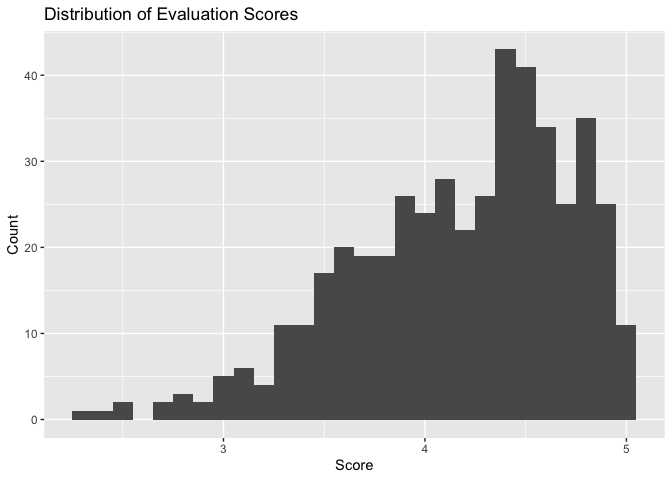
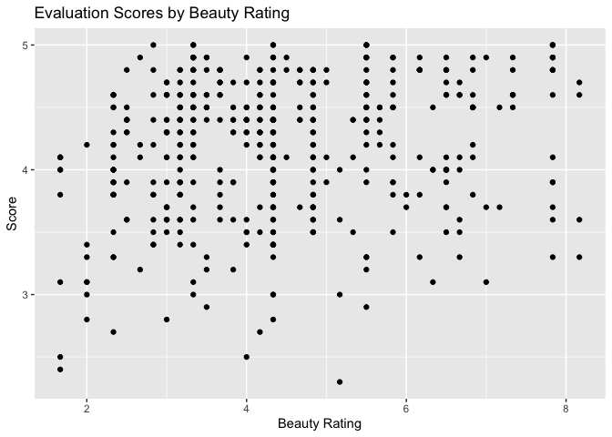
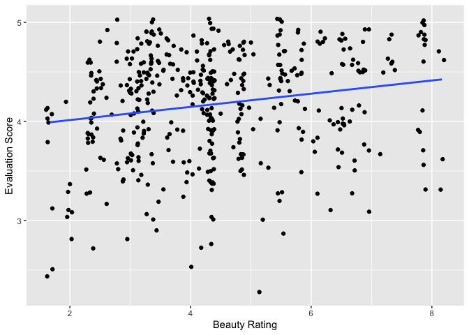

Lab 10 - Grading the professor
================
Sophie Boyd
3-6-26

Here is a link to the [lab
instructions](https://datascience4psych.github.io/DataScience4Psych/lab10.html).

## Load Packages and Data

``` r
library(tidyverse) 
library(tidymodels)
library(openintro)
```

# Part 1: Getting to know the outcome

## Exercise 1

``` r
evals %>%
  ggplot(aes(x = score)) +
  geom_histogram(binwidth = .1) +
  labs(x = 'Score',
       y = 'Count',
       title = 'Distribution of Evaluation Scores')
```

<!-- -->

``` r
mean(evals$score)
```

    ## [1] 4.17473

``` r
median(evals$score)
```

    ## [1] 4.3

``` r
min(evals$score)
```

    ## [1] 2.3

``` r
max(evals$score)
```

    ## [1] 5

Most students provided high evaluation ratings for their professors. The
distribution of scores is skewed left, with most scores on the high end
and a few scores on the low end.

## Exercise 2

``` r
evals %>%
  ggplot(aes(x = bty_avg, y = score)) +
  geom_point() + 
  labs(x = 'Beauty Rating',
       y = 'Score',
       title = 'Evaluation Scores by Beauty Rating')
```

<!-- -->

I don’t see an especially clear trend in the relationship between beauty
ratings and evaluation ratings on the scatterplot. There appears to be
some organization into columns, where groups of professors with the same
beauty ratings have a range of evaluation scores.

## Exercise 3

``` r
evals %>%
  ggplot(aes(x = bty_avg, y = score)) +
  geom_jitter() + 
  labs(x = 'Beauty Rating',
       y = 'Score',
       title = 'Evaluation Scores by Beauty Rating')
```

<!-- -->

Jittering separates points that overlap each other on the scatterplot,
providing more information about the density of the points. By
jittering, we can see that scores are more concentrated at high values
than low values across different beauty ratings, and especially among
higher beauty ratings. (A positive association between beauty ratings
and evaluation scores becomes clearer.) If someone were to only see the
non-jittered plot, they might mistakenly assume that evaluation scores
were evenly distributed among high and low values within groups of
professors with the same beauty rating, when in fact higher evaluation
ratings tended to be more common.

# Part 2: Beauty as a predictor

## Exercise 1

``` r
m_bty <- lm(score ~ bty_avg, data = evals)
summary(m_bty)
```

    ## 
    ## Call:
    ## lm(formula = score ~ bty_avg, data = evals)
    ## 
    ## Residuals:
    ##     Min      1Q  Median      3Q     Max 
    ## -1.9246 -0.3690  0.1420  0.3977  0.9309 
    ## 
    ## Coefficients:
    ##             Estimate Std. Error t value Pr(>|t|)    
    ## (Intercept)  3.88034    0.07614   50.96  < 2e-16 ***
    ## bty_avg      0.06664    0.01629    4.09 5.08e-05 ***
    ## ---
    ## Signif. codes:  0 '***' 0.001 '**' 0.01 '*' 0.05 '.' 0.1 ' ' 1
    ## 
    ## Residual standard error: 0.5348 on 461 degrees of freedom
    ## Multiple R-squared:  0.03502,    Adjusted R-squared:  0.03293 
    ## F-statistic: 16.73 on 1 and 461 DF,  p-value: 5.083e-05

``` r
tidy(m_bty)
```

    ## # A tibble: 2 × 5
    ##   term        estimate std.error statistic   p.value
    ##   <chr>          <dbl>     <dbl>     <dbl>     <dbl>
    ## 1 (Intercept)   3.88      0.0761     51.0  1.56e-191
    ## 2 bty_avg       0.0666    0.0163      4.09 5.08e-  5

For each 1-point increase in beauty rating, the model predicts a
.067-point increase in evaluation score.

## Exercise 2

``` r
evals %>%
  ggplot(aes(x = bty_avg, y = score)) +
  geom_jitter() +
  geom_smooth(method = "lm", se = FALSE) +
  labs(x = 'Beauty Rating',
       y = 'Evaluation Score')
```

<!-- -->

## Exercise 3

- The slope is relatively small, indicating only a .067-point increase
  in evaluation score for each 1-point increase in beauty rating.
- The predicted evaluation score for a professor with a beauty rating of
  0 is 3.88. In context, I don’t think this value is particularly
  meaningful. I believe that beauty ratings ranged from 1-10, in which
  case a rating of 0 would not be possible in our dataset.
- The R-square value is .035, meaning that beauty ratings explain 3.5%
  of the variance in evaluation scores. Overall, it seems that a
  professor’s attractiveness is not especially influential in student
  evaluations.
- At this stage, leaving the shading on the plot may lead someone to
  overstate how well the model fits the data. By looking at the line
  only, it is easier to where the model does not match up with the
  actual data.

# Part 3: Linear regression with a categorical predictor

\##Exercise 1

``` r
m_gen <- lm(score ~ gender, data = evals)
summary(m_gen)
```

    ## 
    ## Call:
    ## lm(formula = score ~ gender, data = evals)
    ## 
    ## Residuals:
    ##      Min       1Q   Median       3Q      Max 
    ## -1.83433 -0.36357  0.06567  0.40718  0.90718 
    ## 
    ## Coefficients:
    ##             Estimate Std. Error t value Pr(>|t|)    
    ## (Intercept)  4.09282    0.03867 105.852  < 2e-16 ***
    ## gendermale   0.14151    0.05082   2.784  0.00558 ** 
    ## ---
    ## Signif. codes:  0 '***' 0.001 '**' 0.01 '*' 0.05 '.' 0.1 ' ' 1
    ## 
    ## Residual standard error: 0.5399 on 461 degrees of freedom
    ## Multiple R-squared:  0.01654,    Adjusted R-squared:  0.01441 
    ## F-statistic: 7.753 on 1 and 461 DF,  p-value: 0.005583

The reference level for gender is female. The model predicts that, on
average, male professors’ evaluation ratings will be .14 points higher
than female professors’ evaluation ratings.

Predicted evaluation score for female professor = 4.09 (intercept)
Predicted evaluation score for male professor = 4.23 (intercept + slope)

## Exercise 2

``` r
evals <- evals %>%
  mutate(rank_relevel = relevel(rank, ref = "tenure track"))

evals <- evals %>%
  mutate(tenure_eligible = case_when(
    rank == "teaching" ~ "no",
    rank == "tenure track" ~ "yes",
    rank == "tenured" ~ "yes"
  ))
```

``` r
m_rank <- lm(score ~ rank, data = evals)
summary(m_rank)
```

    ## 
    ## Call:
    ## lm(formula = score ~ rank, data = evals)
    ## 
    ## Residuals:
    ##     Min      1Q  Median      3Q     Max 
    ## -1.8546 -0.3391  0.1157  0.4305  0.8609 
    ## 
    ## Coefficients:
    ##                  Estimate Std. Error t value Pr(>|t|)    
    ## (Intercept)       4.28431    0.05365  79.853   <2e-16 ***
    ## ranktenure track -0.12968    0.07482  -1.733   0.0837 .  
    ## ranktenured      -0.14518    0.06355  -2.284   0.0228 *  
    ## ---
    ## Signif. codes:  0 '***' 0.001 '**' 0.01 '*' 0.05 '.' 0.1 ' ' 1
    ## 
    ## Residual standard error: 0.5419 on 460 degrees of freedom
    ## Multiple R-squared:  0.01163,    Adjusted R-squared:  0.007332 
    ## F-statistic: 2.706 on 2 and 460 DF,  p-value: 0.06786

``` r
m_rank_relevel <- lm(score ~ rank_relevel, data = evals)
summary(m_rank_relevel)
```

    ## 
    ## Call:
    ## lm(formula = score ~ rank_relevel, data = evals)
    ## 
    ## Residuals:
    ##     Min      1Q  Median      3Q     Max 
    ## -1.8546 -0.3391  0.1157  0.4305  0.8609 
    ## 
    ## Coefficients:
    ##                      Estimate Std. Error t value Pr(>|t|)    
    ## (Intercept)           4.15463    0.05214  79.680   <2e-16 ***
    ## rank_relevelteaching  0.12968    0.07482   1.733   0.0837 .  
    ## rank_releveltenured  -0.01550    0.06228  -0.249   0.8036    
    ## ---
    ## Signif. codes:  0 '***' 0.001 '**' 0.01 '*' 0.05 '.' 0.1 ' ' 1
    ## 
    ## Residual standard error: 0.5419 on 460 degrees of freedom
    ## Multiple R-squared:  0.01163,    Adjusted R-squared:  0.007332 
    ## F-statistic: 2.706 on 2 and 460 DF,  p-value: 0.06786

``` r
m_tenure <- lm(score ~ tenure_eligible, data = evals)
summary(m_tenure)
```

    ## 
    ## Call:
    ## lm(formula = score ~ tenure_eligible, data = evals)
    ## 
    ## Residuals:
    ##     Min      1Q  Median      3Q     Max 
    ## -1.8438 -0.3438  0.1157  0.4360  0.8562 
    ## 
    ## Coefficients:
    ##                    Estimate Std. Error t value Pr(>|t|)    
    ## (Intercept)          4.2843     0.0536  79.934   <2e-16 ***
    ## tenure_eligibleyes  -0.1406     0.0607  -2.315    0.021 *  
    ## ---
    ## Signif. codes:  0 '***' 0.001 '**' 0.01 '*' 0.05 '.' 0.1 ' ' 1
    ## 
    ## Residual standard error: 0.5413 on 461 degrees of freedom
    ## Multiple R-squared:  0.0115, Adjusted R-squared:  0.009352 
    ## F-statistic: 5.361 on 1 and 461 DF,  p-value: 0.02103

## Exercise 3

##### Model using original “rank” variable:

- Intercept: The average predicted evaluation score for teaching
  professors is 4.28.
- Slopes: On average, tenure track professors are expected to have
  evaluation scores .13 points lower than teaching professors. Tenured
  professors are expected to have evaluation scores .15 points lower
  than teaching professors.

##### Model using “rank_relevel”:

- Intercept: The average predicted evaluation score for tenure track
  professors is 4.15.
- On average, teaching professors are expected to have evaluation scores
  .13 points higher than tenure track professors. Tenured professors are
  expected to have evaluation scores .02 points lower than tenure track
  professors.

##### Model using “tenure_eligible”:

- Intercept: The average predicted evaluation score for teaching
  professors is 4.28.
- Slope: Compared to teaching professors, tenure eligible professors are
  predicted to have evaluation scores that are, on average, .14 points
  lower.

Taken together, the three models communicate that teaching professors
perform best on student evaluations.

## Exercise 4

The R-square value is .012, meaning that rank only explains about 1.2%
of the variance in evaluation scores. Overall, rank seems to play a
small role.

## Hint

For Exercise 12, the `relevel()` function can be helpful!
