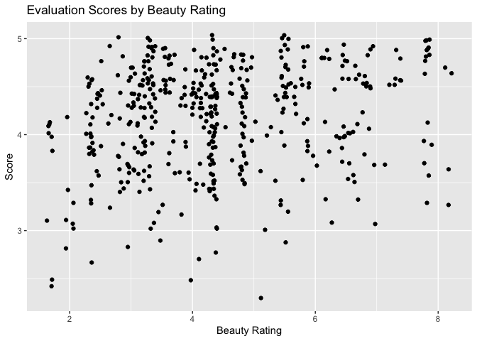

Lab 10 - Grading the professor
================
Sophie Boyd
3-6-26

Here is a link to the [lab
instructions](https://datascience4psych.github.io/DataScience4Psych/lab10.html).

## Load Packages and Data

``` r
library(tidyverse) 
library(tidymodels)
library(openintro)
```

## Exercise 1

``` r
evals %>%
  ggplot(aes(x = score)) +
  geom_histogram(binwidth = .1) +
  labs(x = 'Score',
       y = 'Count',
       title = 'Distribution of Evaluation Scores')
```

<!-- -->

``` r
mean(evals$score)
```

    ## [1] 4.17473

``` r
median(evals$score)
```

    ## [1] 4.3

``` r
min(evals$score)
```

    ## [1] 2.3

``` r
max(evals$score)
```

    ## [1] 5

Most students provided high evaluation ratings for their professors. The
distribution of scores is skewed left, with most scores on the high end
and a few scores on the low end.

## Exercise 2

``` r
evals %>%
  ggplot(aes(x = bty_avg, y = score)) +
  geom_point() + 
  labs(x = 'Beauty Rating',
       y = 'Score',
       title = 'Evaluation Scores by Beauty Rating')
```

<!-- -->

I don’t see an especially clear trend in the relationship between beauty
ratings and evaluation ratings on the scatterplot. There appears to be
some organization into columns, where groups of professors with the same
beauty ratings have a range of evaluation scores.

``` r
evals %>%
  ggplot(aes(x = bty_avg, y = score)) +
  geom_jitter() + 
  labs(x = 'Beauty Rating',
       y = 'Score',
       title = 'Evaluation Scores by Beauty Rating')
```

<!-- -->

Jittering separates points that overlap each other on the scatterplot,
providing more information about the density of the points. By
jittering, we can see that scores are more concentrated at high values
than low values across different beauty ratings, and especially among
higher beauty ratings. (A positive association between beauty ratings
and evaluation scores becomes clearer.) If someone were to only see the
non-jittered plot, they might mistakenly assume that evaluation scores
were evenly distributed among high and low values within groups of
professors with the same beauty rating, when in fact higher evaluation
ratings tended to be more common.

## Additional Exercises

*Repeat the format above for additional exercises.*

## Hint

For Exercise 12, the `relevel()` function can be helpful!
